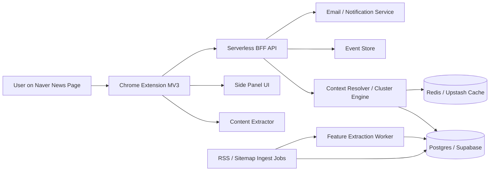

# 04. 기술 아키텍처 스펙

## 1. 문서 목적
이 문서는 뉴스컨텍스트 v1의 시스템 구성, 모듈 역할, 배포 구조, 데이터 흐름, 성능 기준, 장애 대응을 정의한다.

---

## 2. 아키텍처 목표
### 핵심 목표
1. **최소 권한 확장프로그램**
2. **빠른 컨텍스트 응답**
3. **네이버 API 단일 의존 제거**
4. **v2/v3 확장을 고려한 모듈 분리**
5. **저작권/프라이버시 리스크 최소화**

### 설계 원칙
- 사용자 액션 기반 실행
- 클라이언트는 얇게, 검색/클러스터링은 서버에서
- 기사 본문 전체 저장 최소화
- RSS + sitemap 기반 자체 수집을 본체로
- Naver Search API는 fallback
- 확장프로그램에는 원격 코드 없음

---

## 3. 전체 시스템 구성



---

## 4. 클라이언트(확장프로그램) 구조
### 런타임 환경
- Chrome Extension Manifest V3
- Desktop only
- Chrome 116+

### 권한
- `activeTab`
- `sidePanel`
- `storage`
- `scripting`

### 모듈
#### 1) Action Handler
- 브라우저 액션 버튼 클릭 이벤트 처리
- Side Panel 열기

#### 2) Content Extractor
- 현재 페이지에서 기사 정보 추출
- JSON-LD 우선
- meta/OG fallback
- DOM fallback

#### 3) Side Panel App
- React 또는 가벼운 SPA
- 기사 컨텍스트 렌더링
- 저장/피드백/결제 진입

#### 4) Local Storage Layer
- 익명 user/device id 저장
- 동의 상태 저장
- 최근 본 기사 캐시 저장

#### 5) API Client
- `/v1/page/resolve`
- `/v1/watchlists`
- `/v1/events`
- `/v1/feedback`
- `/v1/checkout/session`

### 권한 사용 원칙
- 페이지 접근은 사용자 클릭 시에만
- 상시 주입형 content script 최소화
- `<all_urls>` 금지

---

## 5. 서버 구조
### 권장 배포 구성
- **BFF/API**: Cloudflare Workers 또는 Vercel Functions
- **DB**: Supabase Postgres
- **Cache**: Upstash Redis
- **Background Jobs**: Supabase scheduled jobs / GitHub Actions / Cloudflare cron
- **Email**: Resend
- **Analytics**: 자체 events table 또는 Mixpanel

### 서버 모듈
#### 1) Resolve API
입력 기사 정보로 cluster 탐색, ranking, freshness signal 계산

#### 2) Cluster Engine
같은 이슈 후보 생성 및 스코어링

#### 3) Ingest Pipeline
RSS / sitemap 수집 → canonical article 저장

#### 4) Feature Extraction Worker
토큰, 개체명, 숫자, 해시, embedding 생성

#### 5) Watchlist Service
사용자 저장 이슈 및 브리핑 생성

#### 6) Billing Service
Founder Pass / 향후 정기결제 상태 반영

#### 7) Feedback Service
관련도/유용성 피드백 수집

---

## 6. 데이터 소스 전략
### 우선순위
1. 언론사 RSS
2. 사이트맵
3. 공개 기사 메타데이터
4. Naver Search API fallback

### 이유
- RSS는 최신 기사 공급에 적합하다.
- 사이트맵은 RSS 미제공 매체를 보완한다.
- 메타데이터는 기사 본문 저장 없이도 출처/시간/제목 정보를 확보하게 해준다.
- 네이버 검색 API는 fallback으로 쓰되 핵심 의존점으로 두지 않는다.

### 초기 수집 대상
- 네이버 뉴스 주요 섹션 피드(가능한 범위)
- 주요 경제/정치/사회 언론사 RSS 20곳
- 각 언론사 사이트맵/뉴스 sitemap

---

## 7. 기사 파싱 아키텍처
### 파싱 우선순위
1. JSON-LD
2. Open Graph / meta
3. DOM fallback

### 파싱 필드
- title
- canonical_url
- publisher_name
- author_names
- published_at
- modified_at
- article_type
- section
- keywords
- og_description
- body_excerpt
- correction_note_detected
- parse_confidence

### 파서 인터페이스 예시
```ts
interface ParsedArticle {
  url: string;
  canonicalUrl?: string;
  title: string;
  publisherName?: string;
  authorNames?: string[];
  publishedAt?: string;
  modifiedAt?: string;
  articleType?: 'news' | 'opinion' | 'analysis' | 'editorial' | 'unknown';
  section?: string;
  keywords?: string[];
  ogDescription?: string;
  bodyExcerpt?: string;
  correctionNoteDetected?: boolean;
  parseConfidence: number;
}
```

### 실패 처리
- 필수 필드 부족 시 `parse_confidence` 하향
- title 없음 → hard fail
- publisher/published_at 없음 → partial success 가능

---

## 8. 같은 이슈 판별 엔진
### 목표
현재 기사와 같은 이슈를 다루는 기사 3~5개를 높은 precision으로 반환

### 입력
- 현재 기사 parsed metadata
- 최근 72시간 기사 인덱스
- fallback search results

### 후보 생성
- 제목 키워드 기반 inverted index 조회
- 개체명 기반 후보 조회
- 시간 조건(예: ±72시간)
- 필요 시 fallback search 결과 혼합

### feature set
- title lexical similarity
- title semantic similarity
- named entity overlap
- numeric/date overlap
- time proximity
- publisher diversity bonus
- same-url / duplicate penalty

### 초기 점수식
```text
score =
  0.30 * lexical_title_sim +
  0.25 * semantic_title_sim +
  0.20 * entity_overlap +
  0.10 * numeric_overlap +
  0.10 * time_proximity +
  0.05 * diversity_bonus -
  duplicate_penalty
```

### 표시 기준
- cluster member threshold: 0.62
- UI 노출 threshold: 0.65
- 3개 미만이면 `insufficient_results`

### 추천 구현 단계
#### Phase 1
- TF-IDF/BM25 + rules
- 간단 embedding(서버 측)
- heuristic scoring

#### Phase 2
- feedback 기반 re-ranking
- outlet diversity normalization

---

## 9. 클러스터 모델
### 개념
하나의 이슈(topic/story)를 `story_cluster` 단위로 묶는다.

### cluster 생성 규칙
- 유사도가 threshold 이상인 기사 집합이 생기면 cluster 생성/병합
- 최근성 기준으로 `last_seen_at` 갱신
- 일정 기간 이후 inactive 처리

### cluster label 생성
- 상위 entity 2개 + 핵심 명사 1개 조합
- 예: `산업부 / 반도체 / 수출규제`

### cluster 수명 정책
- active: 최근 72시간 갱신
- warm: 7일 이내 갱신
- archived: 7일 초과 무갱신

---

## 10. freshness / update signal 계산
### freshness state
- `fresh`
- `watch_newer`
- `updated`
- `older_context`

### 판단 로직
#### fresh
- 현재 기사 발행 시간이 cluster 상위 최신권이고
- 더 최신 기사 수가 제한적일 때

#### watch_newer
- 같은 cluster 내 더 최신 기사 2건 이상 존재

#### updated
- `modified_at` 존재 또는 수정 흔적 키워드 감지

#### older_context
- 현재 기사 이후 cluster 전체 기사 수가 일정 기준 이상 증가

### 참고 계산 필드
- `newer_article_count`
- `latest_article_ts`
- `article_age_hours`
- `modified_delta_minutes`

---

## 11. 공통 신호 스트립 생성
### 목적
“그래서 뭘 봐야 하지?”를 줄이기 위한 압축 정보

### 입력
- 상위 관련 기사 5개

### 출력
- 상위 공통 entity 3개
- 상위 공통 숫자/퍼센트/금액 2개
- 필요 시 날짜 1개

### 로직
- entity frequency 계산
- 기사 2개 이상에서 등장하는 항목만 표시
- stop entities 제거
- 숫자는 기사 간 의미 없이 우연히 겹친 경우 제외

---

## 12. 캐시 전략
### 목적
- 응답 속도 향상
- 외부 API 사용량 절감
- 반복 기사 조회 성능 보장

### 캐시 키
- `resolve:{canonical_url_hash}`
- `cluster:{cluster_id}`
- `publisher_feed:{feed_id}`

### TTL
- 속보성 이슈 resolve: 6시간
- 일반 기사 resolve: 24시간
- feed fetch: 15분~60분
- cluster summary: 1시간

### invalidation
- 같은 cluster에 새 기사 유입 시 cluster cache invalidation
- current article modified_at 변경 시 resolve cache invalidation

---

## 13. 비동기 잡 설계
### Ingest Jobs
- RSS fetch job
- sitemap discover job
- raw entry canonicalization job

### Feature Jobs
- entity extraction job
- numeric extraction job
- embedding generation job
- cluster assignment job

### User Jobs
- daily briefing generation job
- stale watchlist cleanup job
- billing sync job

### 추천 주기
- RSS fetch: 15분
- sitemap refresh: 6시간
- cluster recompute: 30분
- briefing generation: 오전 7시/사용자 시간대 기준

---

## 14. 장애 및 오류 처리
### 클라이언트 오류
- unsupported page
- parse fail
- network timeout
- auth/paywall state mismatch

### 서버 오류
- ingest source fail
- DB unavailable
- cache unavailable
- resolve timeout

### 대응 원칙
- 사용자에게는 짧고 명확한 문구
- 재시도 가능 시 CTA 제공
- low-confidence 별도 표기
- observability로 원인 추적

### fallback 전략
- 최신 resolve cache 반환
- 관련 기사 수를 줄여 partial success 반환
- Naver Search API fallback 적용

---

## 15. 보안 설계
### 확장프로그램
- 원격 호스팅 코드 금지
- CSP 엄격 설정
- content extraction만 수행
- 쿠키/세션 읽지 않음

### 서버
- API rate limiting
- anon_id 기반 abuse detection
- checkout endpoint 서명 검증
- secret은 서버에만 저장

### 저장 금지 항목
- 전체 브라우징 이력
- 기사 본문 전체 영구 저장
- 광고 식별 목적의 사용자 행동 데이터

---

## 16. observability
### 로그
- parser_fail logs
- resolve latency logs
- cluster low-confidence logs
- billing webhook logs

### 대시보드 항목
- API latency p50/p95
- parser success rate by domain
- related precision sample QA
- event volume
- payment funnel

### 알림 기준
- parser success 특정 도메인 80% 미만
- resolve p95 3초 초과
- ingest job 2회 연속 실패

---

## 17. 기술적 결정(확정)
- 확장프로그램: Chrome MV3
- UI 컨테이너: Side Panel
- 데이터 수집: RSS/Sitemap 중심
- Resolve 엔진: 서버 측 heuristic ranking
- v1 AI: 없음
- 저장: Postgres + Cache
- analytics: 자체 event store 우선

---

## 18. 기술적 결정(후속 확정 필요)
- embedding 모델 선택
- entity extraction 라이브러리 선택
- billing provider 최종 결정
- auth 방식(익명 + email magic link 여부)
- 브리핑 발송 방식

