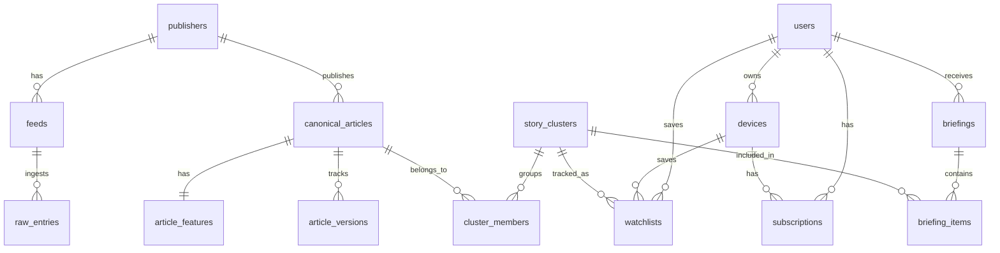

# 06. DB 스키마 설명

## 1. 목적
이 문서는 뉴스컨텍스트 v1/v1.5에서 사용하는 데이터 모델을 설명한다. 실제 DDL은 `06_DB_Schema.sql`에 포함되어 있다.

---

## 2. 설계 원칙
1. 기사 본문 전체 영구 저장을 피하고 메타데이터/파생 feature 중심으로 저장한다.
2. `canonical_articles` 와 `story_clusters` 를 분리해 한 기사와 이슈 단위를 명확히 나눈다.
3. 사용자 식별은 `anon_id` 중심으로 시작하고, 계정 등록은 후순위로 둔다.
4. analytics와 operational DB를 초기에는 같은 Postgres에서 시작하되, 이벤트 볼륨이 커지면 분리 가능하도록 설계한다.

---

## 3. 주요 엔터티
### publishers
언론사 기본 정보

### feeds
RSS/사이트맵 등 수집 소스 정보

### raw_entries
원본 수집 엔트리 저장

### canonical_articles
정규화된 기사 메타데이터

### article_versions
동일 기사 URL의 수정 버전 또는 스냅샷 기록

### article_features
기사에서 파생된 feature 저장

### story_clusters
같은 이슈 묶음

### cluster_members
cluster와 article 관계 및 점수

### users
등록 사용자(향후 magic link 기반)

### devices
익명 디바이스 / anon_id 관리

### subscriptions
플랜 상태 저장

### watchlists
사용자/디바이스별 저장 이슈

### briefings
일일 브리핑 헤더

### briefing_items
브리핑에 포함된 cluster 목록

### events
익명 행동 이벤트

### feedback
명시적 사용자 피드백

### legal_consents
개인정보/분석동의/약관 동의 기록

---

## 4. 테이블별 요약

## publishers
|컬럼|설명|
|---|---|
|id|PK|
|name|언론사명|
|domain|대표 도메인|
|is_active|활성 여부|
|rss_supported|RSS 지원 여부|
|notes|운영 메모|

## feeds
|컬럼|설명|
|---|---|
|id|PK|
|publisher_id|FK publishers|
|feed_type|rss / sitemap / search_fallback|
|url|피드 URL|
|section|정치/경제/사회 등|
|status|active / paused / error|
|last_fetched_at|마지막 수집 시각|

## raw_entries
|컬럼|설명|
|---|---|
|id|PK|
|feed_id|FK feeds|
|source_guid|원본 GUID|
|source_url|원본 링크|
|raw_payload|원문 JSON/XML 일부|
|fetched_at|수집 시각|
|normalized|정규화 완료 여부|

## canonical_articles
|컬럼|설명|
|---|---|
|id|PK|
|publisher_id|FK publishers|
|canonical_url|대표 URL|
|source_url|최초 수집 URL|
|title|기사 제목|
|subtitle|부제|
|author_json|기자 배열 JSON|
|published_at|발행 시각|
|modified_at|수정 시각|
|article_type|news/opinion/analysis/editorial/unknown|
|section|기사 섹션|
|excerpt|짧은 본문 발췌 또는 OG description|
|thumbnail_url|썸네일|
|language_code|ko|
|hash_title|제목 해시|
|status|active/archived/blocked|

## article_versions
|컬럼|설명|
|---|---|
|id|PK|
|article_id|FK canonical_articles|
|version_no|버전 번호|
|title|당시 제목|
|excerpt|당시 발췌|
|published_at|발행 시각|
|modified_at|수정 시각|
|change_reason|수정 감지 사유|
|captured_at|스냅샷 시각|

## article_features
|컬럼|설명|
|---|---|
|article_id|PK/FK canonical_articles|
|title_tokens|제목 토큰 배열|
|entities_json|개체명 JSON|
|numbers_json|숫자/수치 JSON|
|keywords_json|키워드 JSON|
|embedding|vector or jsonb|
|feature_version|피처 버전|
|computed_at|생성 시각|

## story_clusters
|컬럼|설명|
|---|---|
|id|PK|
|label|자동 생성 라벨|
|status|active/warm/archived|
|first_seen_at|첫 기사 유입 시각|
|last_seen_at|마지막 기사 유입 시각|
|article_count|연결 기사 수|
|top_entities_json|상위 개체명|
|top_numbers_json|상위 숫자|

## cluster_members
|컬럼|설명|
|---|---|
|id|PK|
|cluster_id|FK story_clusters|
|article_id|FK canonical_articles|
|score|클러스터 적합 점수|
|rank_in_cluster|표시 우선순위|
|is_primary|대표 기사 여부|
|created_at|연결 시각|

## users
|컬럼|설명|
|---|---|
|id|PK|
|email|고객 이메일|
|email_verified_at|인증 시각|
|created_at|생성 시각|
|status|active/inactive|

## devices
|컬럼|설명|
|---|---|
|id|PK|
|anon_id|익명 식별자|
|user_id|nullable FK users|
|platform|chrome_extension|
|app_version|확장프로그램 버전|
|first_seen_at|최초 사용|
|last_seen_at|마지막 사용|

## subscriptions
|컬럼|설명|
|---|---|
|id|PK|
|user_id|nullable FK users|
|device_id|nullable FK devices|
|plan_code|free/founder_pass/pro/analyst/team|
|status|inactive/active/expired/grace_period/refunded|
|provider|결제 수단|
|provider_ref|외부 결제 ID|
|started_at|시작 시각|
|expires_at|만료 시각|

## watchlists
|컬럼|설명|
|---|---|
|id|PK|
|user_id|nullable FK users|
|device_id|nullable FK devices|
|cluster_id|FK story_clusters|
|label|사용자 라벨|
|notifications_enabled|알림 여부|
|created_at|저장 시각|
|last_viewed_at|마지막 조회 시각|

## briefings
|컬럼|설명|
|---|---|
|id|PK|
|user_id|FK users|
|briefing_date|브리핑 날짜|
|status|pending/sent/failed|
|created_at|생성 시각|
|sent_at|발송 시각|

## briefing_items
|컬럼|설명|
|---|---|
|id|PK|
|briefing_id|FK briefings|
|cluster_id|FK story_clusters|
|priority_score|정렬 점수|
|new_article_count|새 기사 수|

## events
|컬럼|설명|
|---|---|
|id|PK|
|anon_id|익명 식별자|
|user_id|nullable FK users|
|device_id|nullable FK devices|
|event_name|이벤트명|
|event_props|JSONB 속성|
|occurred_at|발생 시각|

## feedback
|컬럼|설명|
|---|---|
|id|PK|
|anon_id|익명 식별자|
|user_id|nullable FK users|
|article_id|nullable FK canonical_articles|
|cluster_id|nullable FK story_clusters|
|feedback_type|helpful/unrelated/outdated/missing_coverage/bug/free_text|
|free_text|자유 입력|
|created_at|생성 시각|

## legal_consents
|컬럼|설명|
|---|---|
|id|PK|
|user_id|nullable FK users|
|device_id|nullable FK devices|
|consent_type|analytics_opt_in/privacy_terms/tos|
|consent_version|버전 문자열|
|consented|동의 여부|
|created_at|동의 시각|

---

## 5. 핵심 관계

---

## 6. 인덱스 전략
### canonical_articles
- unique index on `canonical_url`
- index on `published_at desc`
- index on `(publisher_id, published_at desc)`
- index on `article_type`

### story_clusters
- index on `last_seen_at desc`
- index on `status`

### cluster_members
- unique index on `(cluster_id, article_id)`
- index on `(cluster_id, score desc)`
- index on `(article_id)`

### watchlists
- unique partial index on `(coalesce(user_id::text, device_id::text), cluster_id)`
- index on `(user_id)`
- index on `(device_id)`

### events
- index on `(event_name, occurred_at desc)`
- index on `(anon_id, occurred_at desc)`

---

## 7. 보관/삭제 정책
### raw_entries
- 30일 보관 후 purge 가능

### events
- 180일 보관 후 집계만 유지 가능

### feedback
- 제품 개선을 위해 1년 이상 유지 가능

### article_versions
- 최근 10개 버전 유지 권장

---

## 8. 향후 확장 포인트
- provenance_signals 테이블 추가
- video_sources / transcript_chunks 추가
- B2B report_runs / report_deliveries 추가
- team_accounts / team_members 추가

