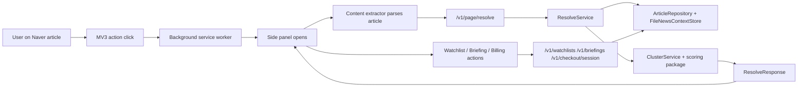

# News Context Monorepo Research Report

## 1. Purpose

This document is a deep technical research report for the `news-context` monorepo. It is written as a system study, not just a README recap. The goal is to explain:

- what the repository contains
- what the product actually does today
- how each runtime layer works
- how data moves through the system
- how release and operational assets are generated
- what is intentionally out of scope
- what a new engineer should read first

The report reflects the repository state as inspected locally through the final pre-deploy audit on `2026-04-13`.

## 2. Executive Summary

This repository is a Node/TypeScript monorepo for a Chrome MV3 side-panel extension called **News Context**.

At the current stage, the product does this:

- supports **desktop Naver News article pages** only
- parses the current article in the browser
- sends structured article metadata to a local API
- uses heuristic similarity scoring to find same-issue coverage
- groups related articles into story clusters
- renders the result in a side panel
- allows one free saved watchlist and a paid `Founder Pass` path
- provides a scaffolded daily briefing for paid users
- ships operational assets for demo/reporting/export use

The architecture is deliberately simple and local-first:

- extension frontend: MV3 side panel + background + content extraction
- API backend: small Node HTTP server with route handlers
- persistence: file-backed JSON store
- jobs: pure builders for ingest/briefing/report assets
- shared contracts: TypeScript domain schema package
- release support: alpha packaging, preflight validation, export validation

The system is **not** a general news platform. It is a focused comparison tool with strong scope constraints:

- single supported publisher surface in-product: `https://n.news.naver.com/*`
- no remote hosted extension code
- no LLM summary generation
- no external paid API product
- no team dashboard
- no full account/auth system
- no production database in the current implementation

The same boundary applies to UI work. The richer editorial visual direction has now been translated into the side panel, and that translation still preserves the actual alpha surface:

- `News Context` remains the product name in shipped UI
- the surface remains a compact Chrome side panel, not a magazine homepage or dashboard
- design polish does not depend on remote hosted code, remote imagery, or scope-expanding navigation
- onboarding, unsupported recovery, user-facing support copy, and briefing recovery behavior stay product rules, not optional styling choices

## 3. Repository Map

Top-level layout:

```text
news-context-layer-specs/
  .github/
  apps/
    api/
    extension/
    jobs/
  docs/
  infra/
  packages/
    scoring/
    shared-types/
  sample-fixtures/
  scripts/
  plan.md
  package.json
  README.md
```

### 3.1 High-value directories

- `apps/api`
  - local API server
  - file-backed repositories
  - resolve, billing, briefing services
- `apps/extension`
  - Chrome MV3 extension
  - background script
  - content extraction
  - side panel UI
  - build/alpha packaging scripts
- `apps/jobs`
  - briefing/report/export builders
  - ingest helpers
  - placeholder worker
- `packages/shared-types`
  - domain contracts
  - store schema
  - reporting and support types
- `packages/scoring`
  - feature extraction and candidate scoring logic
- `scripts`
  - migrations, ingest, fixture import, benchmarking
  - operational export generation
  - release preflight validation
- `infra`
  - dev store path
  - exports
  - migrations
  - seeds
- `docs`
  - product/architecture decisions
  - QA and release checklists
  - public-facing privacy/contact pages

### 3.2 Important root scripts

From `package.json`:

- `build`
- `typecheck`
- `lint`
- `test`
- `test:e2e:extension`
- `benchmark:resolve`
- `ops:sample-report`
- `ops:starter-pack`
- `ops:validate-exports`
- `release:preflight`
- `build:extension`
- `build:alpha`

## 4. Product Boundary

The current product boundary is heavily constrained by design and by code.

### 4.1 What the product does

1. User clicks the extension action on a supported article page.
2. The side panel opens.
3. The extension extracts structured article metadata from the page.
4. The extension asks the API to resolve related coverage.
5. The API persists the current article, computes features, scores candidate articles, and updates a cluster.
6. The side panel shows:
   - source card
   - freshness state
   - common signals
   - related same-issue articles
   - watchlist actions
   - plan/paywall paths

### 4.2 Current hard constraints

- supported in-product surface: `n.news.naver.com`
- extension model: Chrome MV3 side panel
- storage model: local file-backed JSON in the current implementation
- user identity model: device-based anonymous identity
- pricing implementation: beta-era founder-pass mock billing path
- support/contact: placeholder-safe runtime config, not a live helpdesk requirement

### 4.3 Current deliberate non-goals

- general web support across all news sites
- credibility or truth scoring
- political bias classification
- full auth/account recovery flows
- live push notifications
- external API commercialization
- full B2B analytics dashboard
- automatic LLM-written summaries

## 5. End-to-End Runtime Architecture



This architecture is intentionally compact. Almost every product feature can be traced to:

- the extension runtime
- the API server
- the JSON store
- shared domain contracts

## 6. Extension Architecture

The extension lives in `apps/extension`.

### 6.1 Manifest and permissions

Source manifest: `apps/extension/public/manifest.json`

Key characteristics:

- `manifest_version: 3`
- service-worker background
- side panel default path
- icons declared for `16/32/48/128`
- permissions:
  - `activeTab`
  - `sidePanel`
  - `storage`
  - `scripting`
- host permissions in source manifest include:
  - supported article host
  - local API host for dev
  - example/staging API hosts

Important nuance:

- the **source** manifest includes broader dev-time hosts
- the **alpha build** rewrites host permissions to the release-safe set

### 6.2 Background script

File: `apps/extension/src/background/index.ts`

Responsibilities:

- reacts to toolbar action clicks
- records the most recent page context into `chrome.storage.local`
- opens the side panel for the current tab
- serves runtime messages from the side panel

The background script is the bridge between:

- the active browser tab
- content extraction
- persistent panel context

### 6.3 Content extraction pipeline

Files:

- `apps/extension/src/content/runtime.ts`
- `apps/extension/src/content/extractArticle.ts`
- `apps/extension/src/content/types.ts`

The extractor does layered parsing:

1. JSON-LD
2. meta tags
3. visible DOM

It attempts to recover:

- canonical URL
- title
- publisher
- authors
- section
- published/modified time
- keywords
- excerpt/body evidence
- article type

It also computes:

- parser path
- parse confidence
- failure reason
- unsupported state

Important boundary:

- parser support is deliberately narrow and tuned for Naver News desktop article pages
- unsupported URLs are a normal state, not an exception path

### 6.4 Side panel state model

Files:

- `apps/extension/src/sidepanel/state.ts`
- `apps/extension/src/sidepanel/routes.ts`

The side panel state tracks:

- route
- preferences
- identity
- current tab context
- parsed article
- resolve response
- profile
- watchlists
- briefing
- action/loading flags
- notices and paywall state
- support/error/unsupported copy

Primary routes:

- `main`
- `watchlist`
- `plan`
- `settings`

Secondary routes:

- `onboarding`
- `loading`
- `unsupported`
- `error`

### 6.5 Side panel hooks and integration logic

File: `apps/extension/src/sidepanel/hooks.ts`

This file contains most runtime integration logic:

- load or create anonymous device identity
- load preferences from storage
- load runtime config from `window.__NEWS_CONTEXT_CONFIG__`
- build API client
- hash page URLs for analytics
- load profile / watchlists / briefing
- create checkout session
- publish/consume checkout return signals
- read checkout return from:
  - URL query params
  - `window.postMessage`
  - chrome local storage relay

Very important release hardening detail:

- checkout does **not** navigate directly back to `chrome-extension://...`
- billing returns to an API-origin bridge page, which uses `window.opener.postMessage(...)`
- the side panel verifies `event.origin` before accepting the checkout return signal

This design avoids brittle extension-origin redirects from an external or hosted billing-style flow.

### 6.6 Side panel UI composition

File: `apps/extension/src/sidepanel/main.ts`

This file is the central UI orchestrator. It:

- renders the shell
- renders route-specific sections
- binds all UI actions
- boots the panel
- coordinates resolve/account/paywall/briefing/support flows

Main UI sections:

- masthead and primary nav
- notice/paywall banners
- source card
- context metrics rail
- freshness banner
- common-signal strip
- related article list
- watchlist actions
- plan/paywall comparison
- support/contact cards

The main user actions wired here are:

- start/skip onboarding
- retry/refresh
- save watchlist
- delete watchlist
- toggle watchlist notifications
- open briefing
- start checkout
- open related article
- submit feedback
- open support by channel or blocked-state entry point

The latest shipped UI baseline also reflects the newer Stitch/Figma editorial concept in a launch-safe way:

- onboarding, loading, main context, watchlist, plan, and settings now share a warmer editorial hierarchy
- the implementation keeps `News Context` product language and does not ship `The Broadside` branding
- the styling stays inside local CSS and bundled assets, so the MV3 release posture remains unchanged
- the earlier trust-behavior fixes remain semantic product rules, not optional visual treatments

Launch-safe behavior rules now implemented for this surface:

- primary onboarding CTA should complete onboarding and immediately start resolve
- secondary onboarding CTA should defer compare and move the user into a safe route, not silently perform the same action as the primary CTA
- unsupported recovery should name the real destination honestly; opening Naver News home is acceptable, pretending the current unsupported tab is directly recoverable is not
- blocked-state support copy should be user-facing and operationally safe, without surfacing config-key or runtime-source language in the product UI
- briefing failures should recover with retry plus support guidance, rather than leaving the user on a raw helper-text dead end

### 6.7 View-model helpers

File: `apps/extension/src/sidepanel/view-model.ts`

These helpers convert raw API payloads into UI decisions:

- author line formatting
- timestamp formatting
- helper/status copy
- saved-cluster detection
- plan label
- watchlist usage label
- Founder Pass checks
- briefing CTA label
- paywall title/description

This keeps core UI logic in `main.ts` readable while centralizing display rules.

### 6.8 Support/contact behavior

File: `apps/extension/src/lib/support.ts`

Support is modeled as runtime-configured channels, not a hardcoded helpdesk.

Channels:

- `beta_user_support`
- `billing_issue`
- `parser_or_resolve_quality`
- `b2b_inquiry`

Blocked-state entry points:

- `billing_paywall`
- `quality_review`
- `unsupported_or_error`
- `b2b_inquiry`

Important operational rule:

- support links may be empty in early alpha
- empty or unsafe links do not break the UI
- the UI falls back to placeholder-safe notices instead of dead external links
- alpha settings/support surfaces may summarize readiness, but they should still avoid internal implementation language such as config keys, runtime source paths, or placeholder terminology

### 6.9 Runtime configuration

Config is injected through generated `window.__NEWS_CONTEXT_CONFIG__`.

Files:

- `apps/extension/public/sidepanel/config.js`
- `apps/extension/scripts/support-runtime-config.mjs`
- `apps/extension/scripts/build-alpha.mjs`

Current runtime config categories:

- API base URL
- release channel
- support channel metadata

## 7. API Architecture

The API lives in `apps/api` and is intentionally lightweight.

### 7.1 Server model

File: `apps/api/src/server.ts`

This is a Node HTTP server, not Express/Fastify/Nest.

Main routes:

- `GET /health`
- `POST /v1/page/resolve`
- `GET /v1/me`
- `GET /v1/briefings`
- `POST /v1/checkout/session`
- `GET /billing/mock/checkout`
- `GET /billing/mock/complete`
- `GET /billing/mock/cancel`
- `GET /billing/mock/return`
- `GET /v1/watchlists`
- `POST /v1/watchlists`
- `PATCH /v1/watchlists/:id`
- `DELETE /v1/watchlists/:id`
- `POST /v1/events`

The server wires together:

- `FileNewsContextStore`
- `ResolveService`
- `BillingService`
- `BriefingService`

### 7.2 Identity model

The API is device-oriented at the current stage.

Headers used:

- `X-Device-Id`
- `X-Anon-Id`
- `X-App-Version`

Some routes also tolerate `X-User-Token` aliasing for compatibility with the design docs, but the effective current implementation is still anonymous device identity.

### 7.3 File-backed persistence

Core file: `apps/api/src/repositories/file-store.ts`

This repository is the persistence backbone for the current system.

Properties:

- stores all logical tables in one JSON file
- writes atomically using temp-file replacement
- auto-bootstraps devices and free subscriptions
- derives effective plan from latest subscription
- enforces free-vs-paid watchlist limits

Key behaviors:

- free plan watchlist limit: `1`
- paid plan watchlist limit: `50`
- paid briefing access only if active paid plan
- devices are auto-created on first use
- free subscription rows are auto-created when absent

Default file path:

- `infra/dev-data/news-context.store.json`

unless overridden by `DEV_STORE_PATH`.

### 7.4 Article persistence

File: `apps/api/src/repositories/article-repository.ts`

This repository upserts canonical articles and article versions.

Important logic:

- canonicalize URL before matching
- fallback identity uses publisher + title hash + published time
- article versions are recorded when material content changes
- later requests can improve partial metadata already stored

## 8. Resolve Engine

The resolve pipeline is the product’s core.

### 8.1 Feature extraction and scoring package

File: `packages/scoring/src/index.ts`

This package performs heuristic feature extraction and scoring.

Feature outputs:

- title tokens
- entity tokens
- numeric tokens
- keyword tokens
- token-frequency embedding

Scoring inputs:

- lexical title overlap
- semantic-ish token cosine similarity
- entity overlap
- numeric overlap
- time proximity
- publisher diversity bonus
- duplicate penalty

The package is intentionally simple and transparent. There are no external ML model calls.

### 8.2 Resolve service

File: `apps/api/src/services/resolve-service.ts`

Key constants:

- candidate window: `72h`
- related article max: `5`
- UI threshold: `0.65`
- insufficient-results backfill threshold: `0.55`

Resolve flow:

1. validate request
2. infer publisher
3. persist source article
4. ensure source article features
5. ensure candidate article features
6. list candidate articles within time window
7. filter candidates by seed signals
8. score candidates
9. select diverse top related set
10. sync cluster
11. compute response-level context confidence
12. compute freshness and common signals
13. emit monitoring events when needed

### 8.3 Candidate filtering

Before full scoring, the service narrows candidates using cheap seed signals:

- title overlap
- entity overlap
- numeric overlap
- section match
- article-type match

This reduces noise and keeps the heuristic system fast.

### 8.4 Cluster synchronization

File: `apps/api/src/services/cluster-service.ts`

Responsibilities:

- cluster member thresholding
- cluster label generation
- cluster status transitions
- top entity/number maintenance
- rank ordering within clusters
- first/last seen timestamps

Cluster statuses are time-based:

- `active`
- `warm`
- `archived`

### 8.5 Resolve response semantics

The resolve response contains:

- source card
- cluster id
- context confidence
- freshness state
- common signals
- related articles
- UI hints
- disclaimer

Possible resolve states:

- `success_full`
- `success_partial`
- `low_confidence`
- `insufficient_results`

This is important: a low-confidence result is still a normal product state, not necessarily an error.

## 9. Briefings, Watchlists, and Billing

### 9.1 Watchlists

Watchlists are per-device saved cluster pointers.

Each watchlist stores:

- cluster id
- label
- notification-ready flag
- timestamps

The side panel uses watchlists for repeat-use framing and future retention hooks.

### 9.2 Briefings

File: `apps/api/src/services/briefing-service.ts`

Briefings are generated on demand today, not by a scheduler.

Behavior:

- requires `briefing_enabled`
- defaults timezone to `Asia/Seoul`
- uses jobs builder `buildDailyBriefingScaffold`
- persists `briefings` and `briefing_items`
- returns latest 3 articles per cluster

This is not yet an email delivery pipeline. It is a persisted retrieval flow plus UI access path.

### 9.3 Billing

Files:

- `apps/api/src/services/billing-service.ts`
- `apps/api/src/services/mock-billing-provider.ts`

Current billing characteristics:

- only `founder_pass`
- beta-era mock provider path
- one-time billing framing
- checkout session creation via API
- success/cancel routed through hosted return bridge

Important design decision:

- the billing bridge returns on API origin and posts the result back to the side panel
- this avoids extension-origin redirect problems

## 10. Jobs, Ingest, and Reporting

The jobs package does two different kinds of work:

- ingest helpers
- operational/report builders

### 10.1 Ingest

Files:

- `apps/jobs/src/ingest/fetch-rss.ts`
- `apps/jobs/src/ingest/fetch-sitemap.ts`
- `apps/jobs/src/ingest/normalizer.ts`
- `apps/jobs/src/ingest/xml.ts`

These support the ingestion priorities defined in the docs:

1. publisher RSS
2. publisher sitemap
3. public article metadata/page metadata
4. search fallback

In the current local implementation, ingest is not the dominant runtime path for the extension itself. The extension can resolve against a store populated from fixtures or prior ingest.

### 10.2 Daily briefing scaffold builder

File: `apps/jobs/src/briefing/build-daily-briefing.ts`

This builder:

- lists cluster snapshots
- computes per-item priority score
- boosts watchlist-linked clusters
- emits up to `3` items by default
- includes:
  - latest articles
  - new article count
  - common entities/numbers
  - briefing angle
  - freshness note

### 10.3 Sample issue report builder

File: `apps/jobs/src/briefing/build-sample-issue-report.ts`

This builder is for demo/reporting use, not UI runtime.

It selects the most persuasive cluster using a readiness score based on:

- coverage volume
- publisher diversity
- signal density
- recency
- match density
- concentration penalty

It intentionally tries to answer:

- why this cluster is the right demo anchor
- why the cluster is good enough for a meeting
- what common signals make the comparison legible

### 10.4 B2B starter pack builder

File: `apps/jobs/src/briefing/build-b2b-starter-pack.ts`

This builder packages:

- sample issue report
- daily briefing
- positioning copy
- proof points
- support flow notes
- sales notes

It is explicitly constrained to beta-safe messaging. It does not promise external API or dashboard capabilities.

### 10.5 B2B roadmap boundary

The current repository now also carries a roadmap-level B2B boundary document:

- `docs/ops/B2B_PRODUCT_ROADMAP.md`

That roadmap separates:

- current starter-report assets that already exist
- recurring report delivery as the next plausible layer
- dashboard/API directions as explicit `Gate after` work

This is important because the codebase already contains B2B-adjacent delivery assets, but the product still deliberately avoids promising a team dashboard or external API.

At the current repo state, that roadmap should be read as **report-first B2B**:

- today: starter pack export, sample issue report, daily briefing scaffold
- next plausible layer: recurring report delivery using the same export path
- `Gate after`: dashboard, analyst workspace, external API productization

## 11. Shared Types and Store Schema

The domain contracts live in `packages/shared-types`.

Important files:

- `packages/shared-types/src/store.ts`
- `packages/shared-types/src/resolve.ts`
- `packages/shared-types/src/briefing.ts`
- `packages/shared-types/src/reporting.ts`
- `packages/shared-types/src/support.ts`

### 11.1 Logical tables in the JSON store

The store schema includes:

- publishers
- feeds
- raw_entries
- canonical_articles
- article_versions
- article_features
- story_clusters
- cluster_members
- users
- devices
- subscriptions
- watchlists
- briefings
- briefing_items
- events
- feedback
- legal_consents

This is effectively a document-serialized relational-ish state model.

### 11.2 Domain design intent

The contracts are strong enough that the system could migrate to a SQL database later without changing product semantics too much. The file store is an implementation choice, not the shape of the product itself.

## 12. Operational Assets and Demo Corpus

### 12.1 Operational exports

Files:

- `scripts/export-starter-report.ts`
- `scripts/generate-sample-report.ts`
- `scripts/lib/operational-assets.ts`

The repository maintains committed exports under `infra/exports`.

Why this matters:

- demo/report assets are deterministic
- CI can verify they regenerate identically
- docs and generated assets stay aligned
- the approved demo pack can move closer to live meeting material without changing release-safe runtime scope

### 12.2 Demo dataset

Primary meeting/demo fixture:

- `sample-fixtures/demo-report-dataset.json`

Benchmark dataset:

- `sample-fixtures/resolve-benchmark.json`

Operational asset generation intentionally uses a deterministic demo dataset rather than live network fetches.

That separation is deliberate:

- `sample-fixtures/demo-report-dataset.json` is allowed to evolve toward a closer-to-live meeting pack
- `sample-fixtures/resolve-benchmark.json` stays stable so ranking and latency budgets do not drift silently
- broader circulation should prefer fixture rotation from vetted ingest snapshots, not direct live fetch during export generation

At the current repo state, the approved export corpus is best described as **closer-to-live but still fixture-backed**:

- the anchor issue still resolves to `economy / export`
- the visible sample pack keeps multi-publisher source texture instead of a single repeated outlet family
- recurring pilot delivery still reads from the same deterministic export bundle and cycle summary

The next quality step for this corpus is still inside the fixture/builder path:

- keep the deterministic export baseline
- avoid live fetch in the export path
- make the anchor selection easier for an operator to defend in a meeting, especially when a larger but less persuasive cluster also exists in the corpus
- if broader circulation is needed, rotate the fixture from a vetted ingest snapshot rather than letting live ingest leak directly into the exported pack

### 12.4 Recurring pilot cadence posture

The recurring B2B loop is now best understood as three operating modes built on the same export path:

- `weekly` -> low-volume pilot
- `twice_weekly` -> steady pilot
- higher-touch executive handoff -> a stricter review overlay on top of one of those cadences

This is intentionally an operations rule, not a UI rule. The repository keeps the same generated assets, but the recurring cycle summary can now describe:

- which cadence is being used
- what ingest cutoff and rerun window the operator should follow
- how long the operator review window should be
- whether a `warn` can be sent with a note or should be cleared before delivery

That is the important product boundary: cadence changes the operating discipline around the bundle, not the bundle's product promise.

The next documentation-quality step is to make the non-default modes just as concrete as the default one:

- show what a `steady_pilot` run looks like in the summary
- show what an `executive_handoff` review overlay changes in practice
- show what kind of operator note turns a `warn` into a still-sendable bundle
- make the pre-handoff sequence explicit enough that an operator can follow it without relying on repo history:
  1. re-lock scope in `docs/ops/B2B_PRODUCT_ROADMAP.md`
  2. compare `infra/exports/b2b/recurring-report-cycle-summary.json` against the example block in `docs/ops/B2B_RECURRING_REPORT_OPERATIONS.md`
  3. if `warn` remains, complete `docs/ops/B2B_PILOT_REVIEW_CHECKLIST.md` with an explicit note
  4. if broader circulation is needed, move to `docs/ops/B2B_VETTED_FIXTURE_ROTATION.md` instead of touching live fetch

That sequence is now also intended to be partly machine-checked through:

- `npm.cmd run ops:verify-recurring-handoff -- --handoff-mode=low_volume_pilot`
- `npm.cmd run ops:verify-recurring-handoff -- --handoff-mode=steady_pilot`
- `npm.cmd run ops:verify-recurring-handoff -- --handoff-mode=higher_touch_executive_handoff`

And the note-writing part is meant to start from committed examples in:

- `docs/ops/B2B_OPERATOR_NOTE_SAMPLES.md`

### 12.3 Export validation

File: `scripts/validate-operational-exports.ts`

This script:

- regenerates exports
- validates structure/content assumptions
- compares against committed artifacts
- fails if drift exists

That makes the operational assets part of the tested baseline, not informal docs.

## 13. Build, Test, and Release Pipeline

### 13.1 Build flow

Main build paths:

- root build: recursive workspace build
- extension build: compile shared-types + extension + copy public assets
- alpha build: clone built extension into `dist-alpha` and inject release-safe config

Files:

- `apps/extension/scripts/build-package.mjs`
- `apps/extension/scripts/build-alpha.mjs`

### 13.2 Alpha packaging

`build-alpha` does all of the following:

- copies `dist` -> `dist-alpha`
- rewrites manifest name/description/version
- narrows host permissions to release-safe entries
- writes runtime config
- writes `alpha-release.json`

Important generated artifact:

- `apps/extension/dist-alpha/alpha-release.json`

This is the release metadata bundle for the current alpha packaging path.

### 13.3 Store listing metadata

File: `apps/extension/scripts/release-metadata-config.mjs`

Required-before-submission keys:

- `STORE_PRIVACY_POLICY_URL`
- `STORE_PUBLIC_CONTACT_URL`

Recommended:

- `STORE_TERMS_OF_SERVICE_URL`

### 13.4 Release preflight

Files:

- `scripts/validate-release-submission.ts`
- `scripts/lib/release-preflight.ts`

Checks include:

- icon declarations present
- icon files exist
- no insecure host permissions
- alpha API base URL is HTTPS
- store listing metadata is configured
- support runtime routes are warning-level only for early alpha

### 13.5 Test strategy

The repository uses several layers of testing:

- unit tests
- service tests
- repository tests
- integration-style API tests
- operational export validation
- extension Playwright runtime smoke
- benchmark script for resolve quality and latency

High-value test files:

- `apps/api/tests/resolve-service.test.ts`
- `apps/api/tests/watchlist-events.test.ts`
- `apps/api/tests/briefings.test.ts`
- `apps/jobs/tests/briefing.test.ts`
- `apps/extension/tests/sidepanel-hooks.test.ts`
- `apps/extension/tests/e2e/extension-runtime.spec.ts`
- `apps/extension/tests/release-preflight.test.ts`

### 13.6 Current release posture

From the current repo state:

- GitHub Pages-backed privacy/contact pages are live
- `release:preflight` is green
- support runtime URLs remain warnings only
- alpha package is generated under `apps/extension/dist-alpha`
- docs still recommend one final stable-Chrome manual confirmation before unlisted upload

## 14. Current Public/Operational Web Assets

The repository now includes public, hostable static pages:

- `docs/public/index.html`
- `docs/public/privacy-policy.html`
- `docs/public/public-contact.html`

These pages are also published via GitHub Pages for store listing use.

This is an important operational split:

- extension/package runtime lives in this monorepo
- minimal public compliance assets can be hosted independently

## 15. Current Runtime and User Flows

### 15.1 Supported article happy path

1. User opens a supported Naver article.
2. User clicks the extension action.
3. Background opens the side panel.
4. Side panel loads preferences and device identity.
5. Side panel loads current tab context.
6. Content extractor parses article metadata.
7. Side panel sends `ResolveRequest` to `/v1/page/resolve`.
8. API resolves same-issue coverage and returns a cluster-based response.
9. Side panel renders source card, freshness, common signals, and related coverage.
10. User can save the current cluster to watchlist.

### 15.2 Unsupported page path

1. Background records context as unsupported.
2. Side panel route becomes `unsupported`.
3. UI offers:
   - retry
   - open supported page
   - support shortcut with placeholder-safe behavior

### 15.3 Paywall / Founder Pass path

1. Free user hits watchlist limit or briefing gate.
2. Side panel opens the `plan` route.
3. User starts checkout.
4. API creates mock founder-pass checkout session.
5. Billing page completes/cancels on API origin.
6. Hosted return bridge posts outcome back to side panel.
7. Side panel refreshes profile and unlocks paid capabilities.

### 15.4 Briefing path

1. Founder Pass user opens briefing.
2. Side panel calls `/v1/briefings`.
3. API generates persisted briefing if missing for that date/device.
4. UI shows the generated briefing item list.

## 16. Important Constraints and Risks

### 16.1 Hard technical constraints

- only Naver News desktop article pages are supported in-product
- release packaging depends on generated runtime config, not handwritten release assets
- store submission relies on external public URLs for privacy/contact

### 16.2 Operational constraints

- current persistence is JSON file-backed, not multi-user production storage
- support/contact can still be placeholder-safe for early alpha
- stable Chrome manual confirmation is the last remaining upload blocker until it is recorded against the current reviewed archive

### 16.3 Repo hygiene nuances

- `packages/shared-types/src` contains generated JS and d.ts artifacts alongside TS sources
- built outputs exist in repo (`dist`, `dist-alpha`, `infra/exports`)
- some Korean markdown renders as mojibake in this terminal environment, which appears to be a display/encoding issue rather than content loss
- the local workspace inspected here is not itself a Git checkout, even though associated public assets were pushed to a separate GitHub repository

## 17. How to Read This Repo Efficiently

Recommended onboarding order:

1. `README.md`
2. `plan.md`
3. `docs/DECISION_LOCK.md`
4. `apps/extension/src/sidepanel/main.ts`
5. `apps/extension/src/content/extractArticle.ts`
6. `apps/api/src/server.ts`
7. `apps/api/src/services/resolve-service.ts`
8. `packages/scoring/src/index.ts`
9. `apps/api/src/repositories/file-store.ts`
10. `apps/jobs/src/briefing/build-sample-issue-report.ts`
11. `scripts/lib/operational-assets.ts`
12. `scripts/lib/release-preflight.ts`

## 18. Most Important Entry Points by Role

### Frontend/extension engineer

- `apps/extension/src/sidepanel/main.ts`
- `apps/extension/src/sidepanel/hooks.ts`
- `apps/extension/src/content/extractArticle.ts`
- `apps/extension/public/sidepanel/styles.css`

### Backend/resolve engineer

- `apps/api/src/server.ts`
- `apps/api/src/services/resolve-service.ts`
- `apps/api/src/services/cluster-service.ts`
- `packages/scoring/src/index.ts`

### Data/reporting engineer

- `apps/jobs/src/briefing/build-daily-briefing.ts`
- `apps/jobs/src/briefing/build-sample-issue-report.ts`
- `apps/jobs/src/briefing/build-b2b-starter-pack.ts`
- `scripts/lib/operational-assets.ts`

### Release/ops engineer

- `apps/extension/scripts/build-alpha.mjs`
- `apps/extension/scripts/release-metadata-config.mjs`
- `scripts/lib/release-preflight.ts`
- `docs/ALPHA_RELEASE_CHECKLIST.md`
- `docs/QA_EXECUTION_NOTES.md`

### Product / B2B strategy reader

- `docs/ops/B2B_PRODUCT_ROADMAP.md`
- `docs/ops/B2B_RECURRING_REPORT_OPERATIONS.md`
- `docs/ops/B2B_TALK_TRACK.md`
- `docs/ops/B2B_STARTER_PACK_DRAFT.md`
- `docs/ops/B2B_OPERATOR_NOTE_SAMPLES.md`
- `infra/exports/b2b/starter-pack-sample.json`

Read these together if the discussion is about B2B scope. The roadmap is the phase boundary, while the talk track and starter pack export are the current proof artifacts.

For recurring pilot delivery, the intended order is:

1. re-lock scope with the roadmap
2. review the talk track, starter pack export, and recurring cycle summary together
3. compare the real summary fields to the intended mode example with `docs/ops/B2B_RECURRING_REPORT_OPERATIONS.md` and `ops:verify-recurring-handoff`
4. if `warn` remains, complete operator review using the checklist and committed note samples
5. improve cadence/corpus/checklist quality before touching UI

Recurring pilot review is now meant to use a shared set of review domains:

- `scope_lock`
- `artifact_consistency`
- `anchor_clarity`
- `repeat_use_narrative`
- `guardrail`
- `operator_follow_up`

The operator checklist remains the human decision surface, but the recurring cycle summary should mirror those domains wherever a deterministic check is possible. In practice, that means the JSON summary is not a replacement for operator review; it is a machine-readable companion that helps different operators make the same call from the same bundle.

If broader external circulation becomes necessary, the intended next step is not live export generation. It is a controlled fixture refresh path from vetted ingest snapshots:

1. ingest and review a candidate snapshot
2. freeze the vetted snapshot as a human-reviewed source
3. derive the deterministic demo fixture from that vetted snapshot
4. regenerate the export bundle and re-run the same recurring quality loop

## 19. Final Assessment

This repository is more mature than a prototype but intentionally narrower than a full platform.

Its strongest characteristics are:

- clear product boundary
- transparent heuristic resolve pipeline
- strong shared contracts
- deterministic operational artifacts
- release preflight discipline
- side-panel-first UX with explicit blocked/error states

Its most important limitations are:

- narrow supported publisher scope
- file-backed persistence
- anonymous device identity model
- still-alpha operational posture

If you understand the following six files, you understand most of the system:

- `apps/extension/src/sidepanel/main.ts`
- `apps/extension/src/content/extractArticle.ts`
- `apps/api/src/server.ts`
- `apps/api/src/services/resolve-service.ts`
- `packages/scoring/src/index.ts`
- `apps/api/src/repositories/file-store.ts`

That is the real operational core of the monorepo.

## 18. Pre-Deploy Review Snapshot

The current launch-priority gap list is now also maintained in `docs/ops/PREDEPLOY_EXPERT_REVIEW.md`.

That review matters because the repository is no longer blocked by missing fundamentals alone. The remaining risk is that several parts of the repo are individually "good enough" while the final release chain still has weak links between them.

The highest-priority findings are now:

- the repo and the live GitHub Pages routes now have release-grade public legal/contact pages, but the final upload should still be rebuilt and archived from the exact candidate immediately before submission
- CI still stops short of release-critical checks like `build:alpha`, `release:preflight`, `benchmark:resolve`, and real browser sign-off
- the earlier first-run and blocked-state trust gaps are now closed in repo; the remaining final gate is the stable Chrome sign-off for the reviewed upload candidate
- the file-backed API store still has overlapping-request reliability risk

For launch readiness, that document should now be treated as the short-form deployment gap list, while this research file remains the long-form explanation of how the system works.
